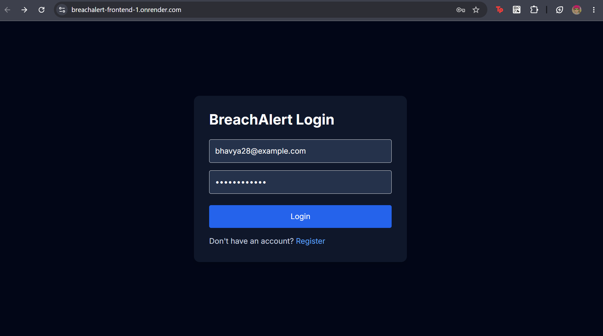
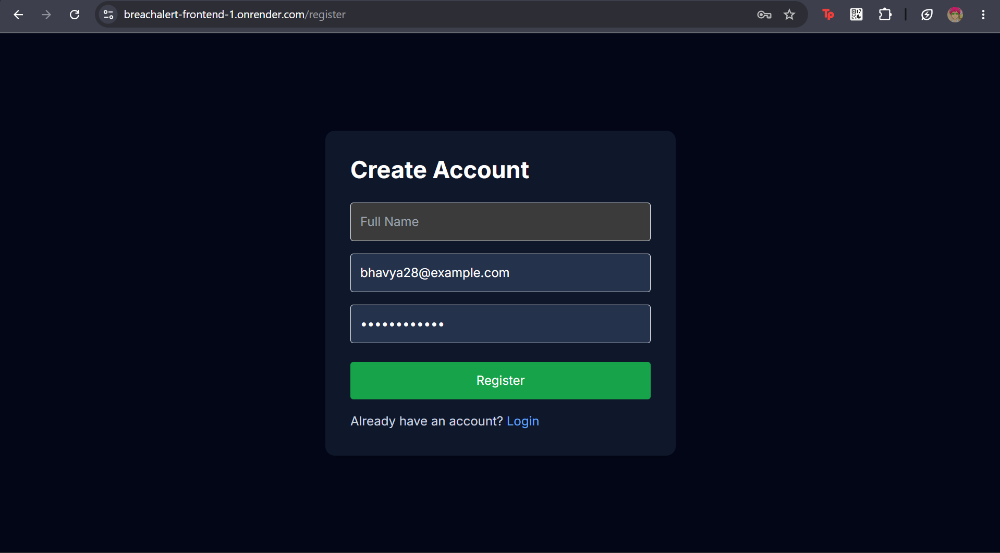
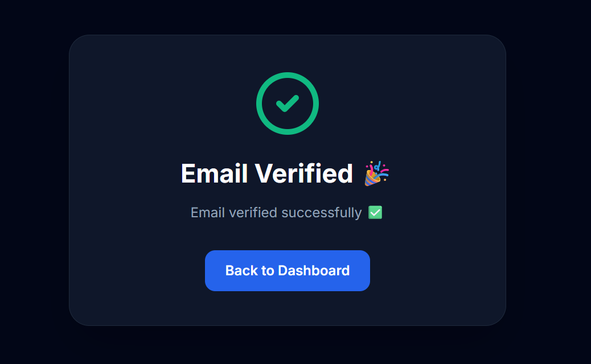
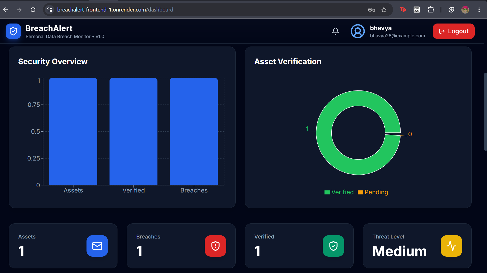
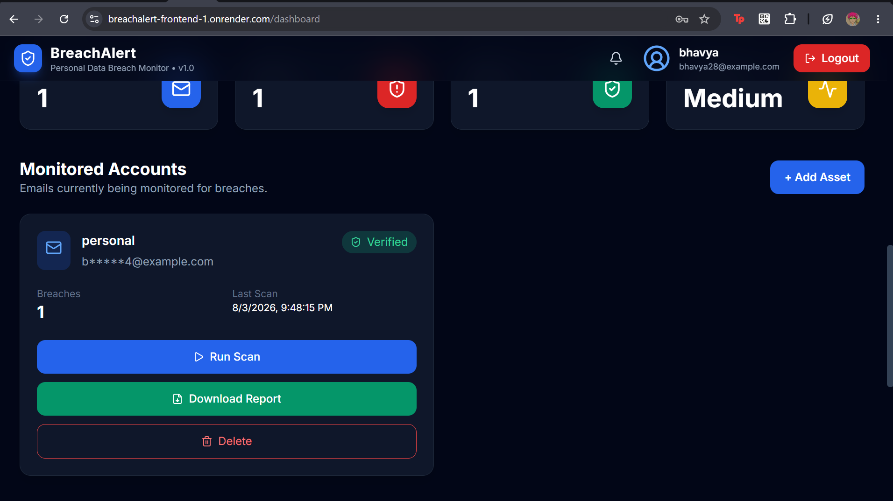
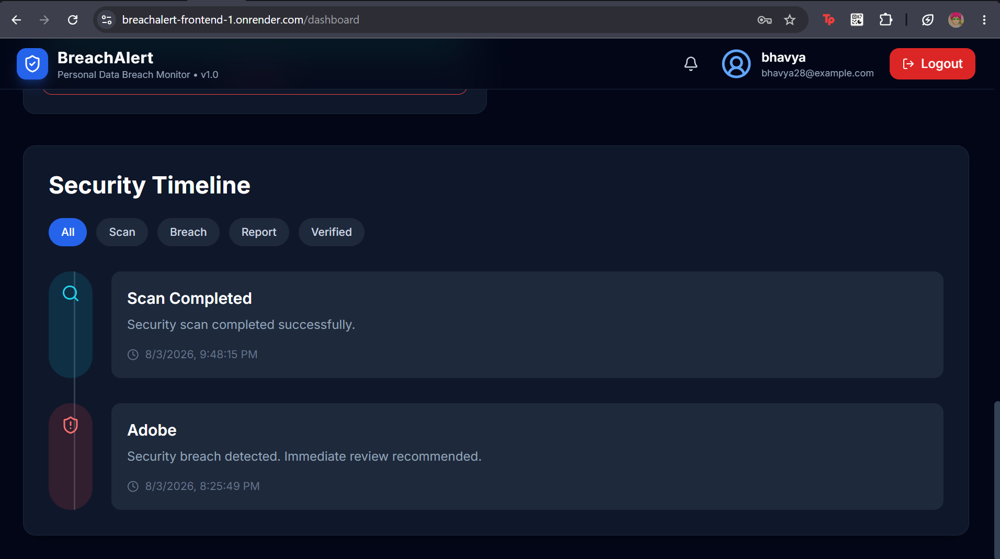
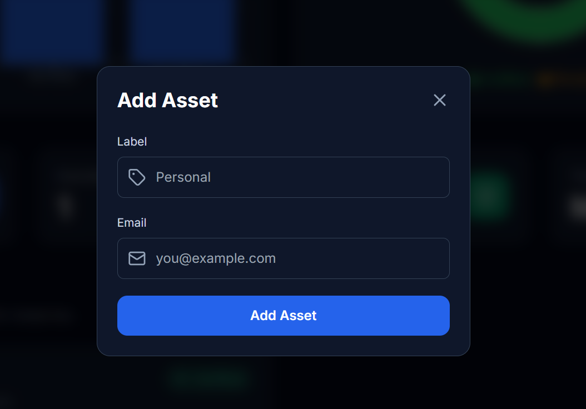
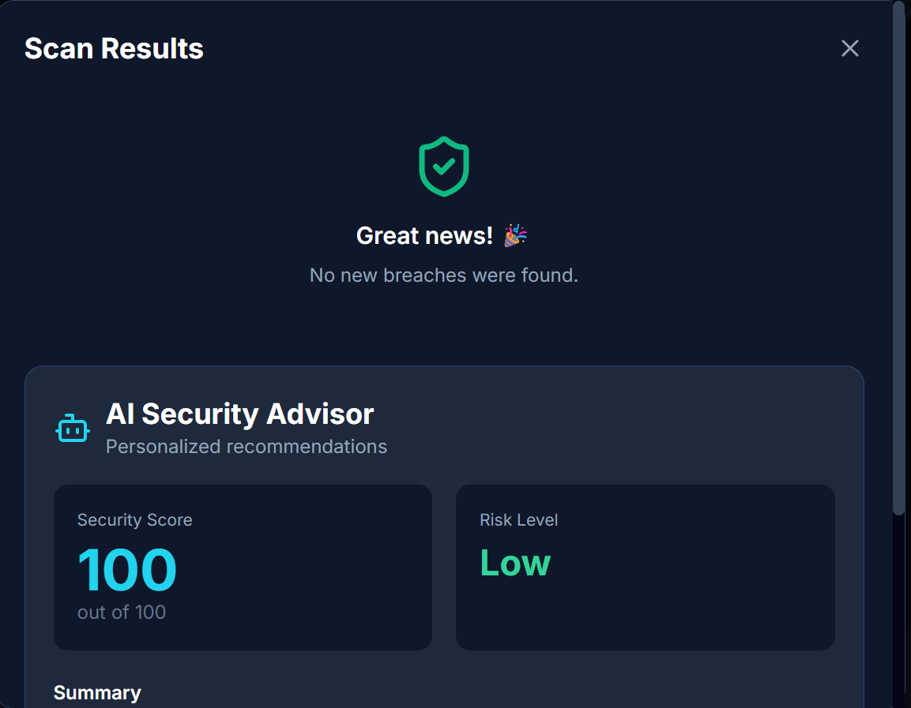

# 🛡️ BreachAlert

<p align="center">

AI-powered Personal Data Breach Monitoring Platform

Monitor your digital identity, detect data breaches, receive real-time alerts, and generate security reports.

</p>

<p align="center">


</p>

---

# 🚀 Live Demo

### 🌐 Frontend

https://breachalert-frontend-1.onrender.com

### 📚 Backend API Docs

https://breachalert-backend-7jof.onrender.com/docs

---

# 📖 Overview

BreachAlert is a full-stack cybersecurity platform that allows users to monitor their email addresses for known public data breaches.

Users can securely register, verify ownership of monitored email addresses, perform breach scans, receive notifications, download PDF reports, and track their security history through a modern dashboard.

The project was built to demonstrate secure backend development, API design, authentication, cloud deployment, and modern frontend development.

---

# ✨ Features

## 🔐 Authentication

- User Registration
- JWT Authentication
- Secure Login
- Protected Routes
- Password Hashing

---

## 📧 Email Verification

- Verify monitored email ownership
- Secure verification tokens
- Token expiry
- Prevent unauthorized monitoring

---

## 🛡️ Breach Monitoring

- Monitor multiple email addresses
- Secure encrypted storage
- Manual breach scanning
- Security score calculation
- Breach timeline

---

## 📊 Dashboard

- Security Overview
- Threat Level
- Verification Status
- Number of Breaches
- Scan History
- Interactive Charts

---

## 📄 Reports

- Download PDF Security Reports
- Breach summaries
- Security recommendations

---

## 🔔 Notifications

- Email Verification
- Breach Alerts
- Scan Updates

---

# 🏗️ Tech Stack

## Frontend

- React
- TypeScript
- Vite
- TailwindCSS
- React Query
- Axios
- React Router

---

## Backend

- FastAPI
- SQLAlchemy
- PostgreSQL
- JWT Authentication
- Alembic
- SendGrid
- Redis

---

## Deployment

- Render
- Docker

---

# 📸 Screenshots

## Login



---

## Register



---

## Email Verification



---

## Dashboard Overview



---

## Monitored Accounts



---

## Security Timeline



---

## Add Asset



---

## Scan Results



---

# 🔄 Application Workflow

```text
User
 │
 ▼
Register
 │
 ▼
Login
 │
 ▼
JWT Authentication
 │
 ▼
Dashboard
 │
 ▼
Add Email Asset
 │
 ▼
Email Verification
 │
 ▼
Run Breach Scan
 │
 ▼
View Results
 │
 ▼
Download Report
```

---

# 🔐 Security Features

- Password hashing
- JWT Authentication
- Email encryption
- Email hashing
- Verification tokens
- Token expiration
- Protected API endpoints
- Secure database storage

---

# 📁 Project Structure

```text
breachalert
│
├── backend
│   ├── app
│   ├── api
│   ├── models
│   ├── schemas
│   ├── services
│   ├── core
│   └── db
│
├── frontend
│   ├── src
│   ├── components
│   ├── pages
│   ├── hooks
│   └── api
│
├── screenshots
│
├── docker-compose.yml
├── Dockerfile
└── README.md
```

---

# ⚙️ Local Installation

Clone the repository

```bash
git clone https://github.com/bhavya2862007/breachalert.git
```

Move into the project

```bash
cd breachalert
```

Backend

```bash
cd backend

pip install -r requirements.txt

uvicorn app.main:app --reload
```

Frontend

```bash
cd frontend

npm install

npm run dev
```

---

# 🔑 Environment Variables

Backend

```env
DATABASE_URL=

SECRET_KEY=

FERNET_KEY=

SENDGRID_API_KEY=

FROM_EMAIL=

HIBP_API_KEY=

REDIS_URL=
```

Frontend

```env
VITE_API_URL=
```

---

# 📚 API Endpoints

Authentication

```
POST /auth/register

POST /auth/login

GET /auth/me
```

Assets

```
GET /assets

POST /assets

DELETE /assets/{id}
```

Verification

```
GET /verify/{token}
```

Scanning

```
POST /scans/{asset_id}
```

Reports

```
GET /reports/{asset_id}
```

History

```
GET /history/{asset_id}
```

---

# 🎯 Future Improvements

- Real-time breach monitoring
- Multi-factor authentication
- Dark/Light themes
- Browser extension
- Password exposure monitoring
- Mobile application
- Multiple notification channels
- AI-powered security recommendations

---

# 👩‍💻 Author

**Bhavya Sharma**

Computer Science & Data Science Student

GitHub:
https://github.com/bhavya2862007

---

# ⭐ Support

If you found this project useful, consider giving it a ⭐ on GitHub.

It really helps!